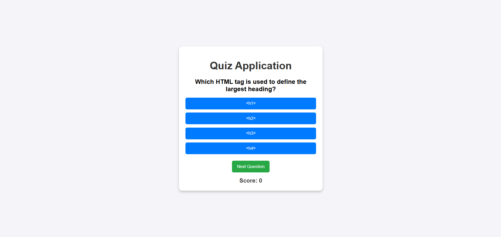
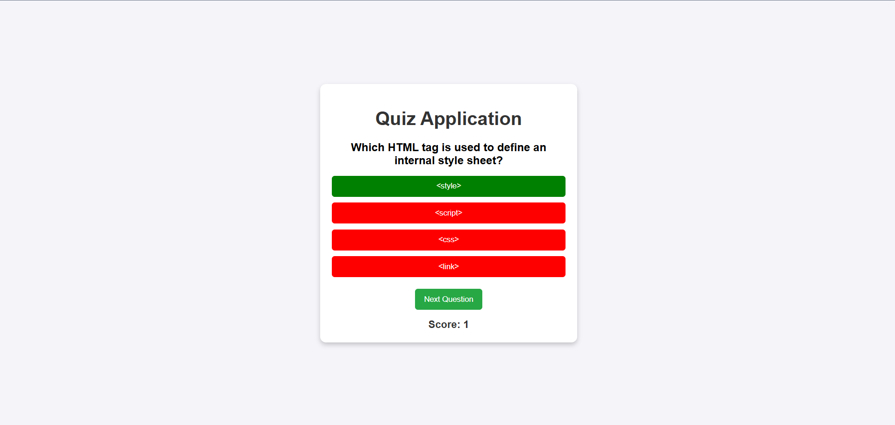
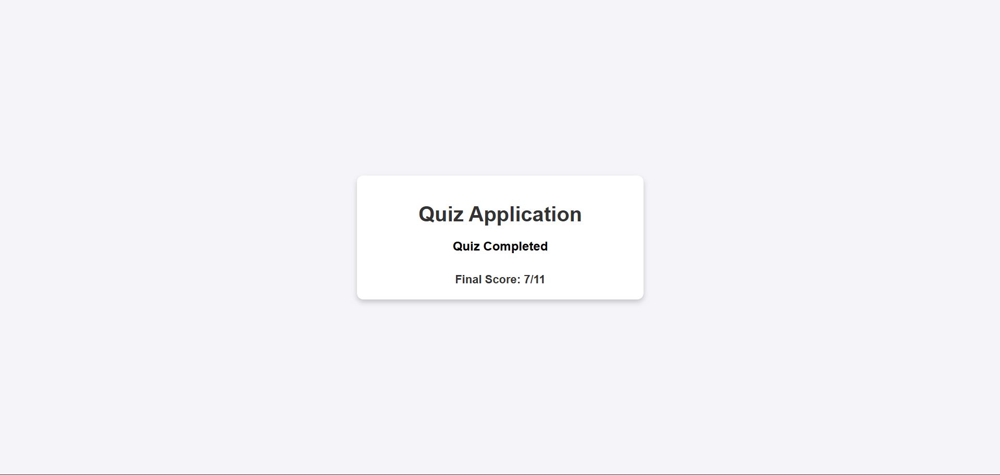

<!-- Header Banner -->

  

  
  
  
  

---

## 📖 About This Project

This is a **fun and interactive Java Quiz App** 🎯  
It’s designed for learners to test and strengthen their Java programming concepts through a clean UI and dynamic questions.  

✨ **Key Highlights:**  
- 📝 Java-based quiz questions (OOPs, Data Types, Loops, etc.)  
- 🎨 Minimal and responsive design  
- 📦 JSON-based question loading  
- 🏆 Real-time score tracking with instant feedback  
- 🚀 Smooth animations for a delightful experience  

---

## ✨ Features

🌟 **Interactive UI** with smooth transitions and animations  
☕ **Java Programming Questions** covering core topics  
📂 **Dynamic Question Loading** from a JSON file  
✅ **Real-time Scoring** with instant feedback (Correct ✅ / Incorrect ❌)  

---

## 🖼️ Screenshots

### 🏠 Home Screen

  

---

### 📝 Quiz In Progress

  

---

### 🏁 Final Score

  

---

## 🛠️ Tech Stack

| Technology      | Role                                      |
|-----------------|-------------------------------------------|
| 🖋 **HTML5**     | Structure of the quiz app                |
| 🎨 **CSS3**      | Styling and animations                   |
| 📜 **JavaScript**| Dynamic behavior and JSON data fetching  |
| 📂 **JSON**      | Stores quiz questions                    |
| ☕ **Java**       | Programming language covered in questions|
